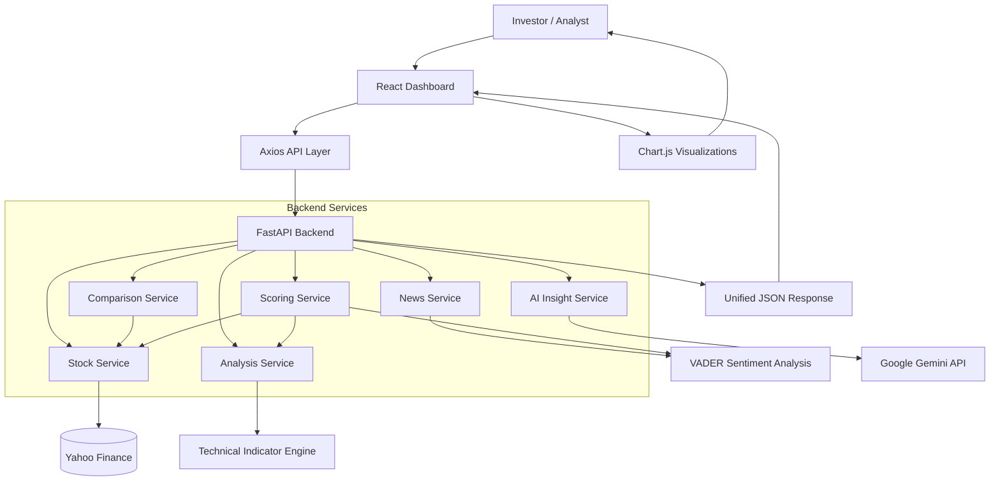

# 📈 StockSutra: AI-Powered Stock Market Analysis Platform

StockSutra is a full-stack financial intelligence platform designed to analyze publicly traded companies using real-time market data, technical indicators, sentiment analysis, and AI-generated investment insights.

The platform combines financial data retrieval, analytical computation, news aggregation, and Large Language Model (LLM) reasoning to help investors understand stock performance and make informed investment decisions.

---

# 📂 Repository Information

- **Project Name:** StockSutra
- **Project Type:** Financial Analytics Platform
- **Architecture Style:** Service-Oriented Client-Server Architecture
- **Frontend:** React + Vite
- **Backend:** FastAPI
- **AI Engine:** Google Gemini
- **Financial Data Provider:** Yahoo Finance

---

# 🏗️ Architecture Overview & System Design

StockSutra follows a modular service-oriented architecture where each business capability is isolated into dedicated service layers.

This separation ensures maintainability, scalability, and clean boundaries between data acquisition, analytical computation, sentiment processing, AI reasoning, and frontend presentation.

---

## 🧩 1. Project Topology

```text
StockSutra/
│
├── backend/
│   ├── app/
│   │   ├── routers/
│   │   │   ├── stock.py
│   │   │   ├── analysis.py
│   │   │   ├── compare.py
│   │   │   ├── score.py
│   │   │   ├── news.py
│   │   │   ├── ai.py
│   │   │   └── history.py
│   │   │
│   │   ├── services/
│   │   │   ├── stock_service.py
│   │   │   ├── indicator_service.py
│   │   │   ├── score_service.py
│   │   │   ├── compare_service.py
│   │   │   ├── news_service.py
│   │   │   ├── ai_service.py
│   │   │   └── history_service.py
│   │   │
│   │   ├── schemas/
│   │   └── main.py
│   │
│   └── requirements.txt
│
├── frontend/
│   ├── src/
│   │   ├── api/
│   │   ├── components/
│   │   ├── layouts/
│   │   └── pages/
│   │
│   └── package.json
│
└── README.md
```

---

## 🔄 2. High-Level Architecture Flow



---

# ⚙️ Core Business Workflows

## 📊 A. Stock Analysis Workflow

### 1. User Request

The investor searches for a stock ticker through the Analysis Dashboard.

Example:

```text
AAPL
MSFT
NVDA
TSLA
```

### 2. Data Acquisition

The request reaches the backend Stock Service.

The service:

- Validates ticker symbol
- Retrieves company information
- Fetches historical stock prices
- Collects valuation metrics
- Retrieves financial ratios

### 3. Analytical Processing

The Analysis Service computes:

- Relative Strength Index (RSI)
- Moving Average Trends
- Momentum Indicators
- Trend Signals

### 4. Sentiment Evaluation

The News Service:

- Retrieves relevant news articles
- Processes headlines and summaries
- Calculates sentiment scores
- Classifies sentiment as:
  - Positive
  - Neutral
  - Negative

### 5. AI Insight Generation

The AI Service sends analytical data to Google Gemini.

Gemini generates:

- Executive Summary
- Bullish Signals
- Bearish Signals
- Risk Factors
- Investment Outlook

### 6. Frontend Presentation

Results are displayed through:

- Stock Cards
- Technical Analysis Cards
- Sentiment Cards
- AI Insight Cards
- Historical Price Charts
- Score Dashboard

---

## ⚖️ B. Stock Comparison Workflow

### User Comparison Request

The user selects two stocks.

Example:

```text
AAPL vs MSFT
NVDA vs AMD
META vs GOOGL
```

### Comparison Engine

The Compare Service:

1. Retrieves both companies' datasets.
2. Normalizes comparable financial metrics.
3. Calculates comparative performance indicators.
4. Produces side-by-side analytics.

### Dashboard Output

The frontend renders:

- Comparison Tables
- Financial Metric Highlights
- Relative Strength Indicators
- Visual Comparison Charts

---

# 🧠 Analytical Components

## 📈 Technical Analysis Engine

The Technical Analysis Engine computes market indicators using historical stock price data.

### Indicators

- Relative Strength Index (RSI)
- Moving Averages
- Price Momentum
- Trend Direction

Outputs are converted into investor-friendly interpretations.

---

## 📰 Sentiment Analysis Engine

The News Service evaluates market sentiment using VADER Sentiment Analysis.

### Sentiment Categories

| Score Range | Classification |
|------------|---------------|
| > 0.05 | Positive |
| -0.05 to 0.05 | Neutral |
| < -0.05 | Negative |

Sentiment contributes to the overall stock rating.

---

## 🤖 AI Intelligence Layer

The AI Service integrates Google's Gemini LLM.

### Responsibilities

- Financial summarization
- Investment reasoning
- Risk assessment
- Opportunity identification
- Natural language explanations

This layer transforms complex financial metrics into readable investor insights.

---

# 🚀 Architecture Features

## Service-Oriented Backend

Each domain responsibility is isolated:

- Stock Service
- Analysis Service
- News Service
- Comparison Service
- AI Service
- Scoring Service

This minimizes coupling and improves maintainability.

---

## Schema Validation

All requests and responses utilize Pydantic schemas.

Benefits:

- Type Safety
- Request Validation
- Predictable API Contracts
- Reduced Runtime Errors

---

## Modular Frontend Architecture

React components are designed for reuse.

Examples:

- SearchBar
- PriceChart
- ScoreCard
- AIInsightCard
- SentimentCard
- TechnicalAnalysisCard
- ComparisonTable

---

## Responsive Dashboard Design

The frontend is built using Tailwind CSS and supports:

- Desktop
- Tablet
- Mobile Devices

---

# 🛠️ Tech Stack

## Frontend

- React 19
- Vite
- Tailwind CSS
- Axios
- Chart.js
- React Router DOM

## Backend

- FastAPI
- Python 3.12
- Uvicorn
- Pydantic

## Data Processing

- Pandas
- NumPy

## Financial Data

- Yahoo Finance (yfinance)

## Artificial Intelligence

- Google Gemini API

## Sentiment Analysis

- VADER Sentiment Analysis

---

# ▶️ Getting Started

## Prerequisites

### Backend

- Python 3.12+
- Pip

### Frontend

- Node.js 18+
- npm

---

## Backend Setup

```bash
cd backend

python -m venv venv

venv\Scripts\activate

pip install -r requirements.txt
```

Create a `.env` file:

```env
GEMINI_API_KEY=your_api_key_here
```

Start the backend server:

```bash
uvicorn app.main:app --reload --port 8003
```

Backend URL:

```text
http://localhost:8003
```

---

## Frontend Setup

```bash
cd frontend

npm install

npm run dev
```

Frontend URL:

```text
http://localhost:5173
```

---

# 📡 API Documentation

| Method | Endpoint | Description |
|----------|----------|----------|
| GET | /stock/{ticker} | Retrieve stock information |
| GET | /analysis/{ticker} | Perform technical analysis |
| GET | /score/{ticker} | Generate stock score |
| GET | /news/{ticker} | Retrieve related news |
| GET | /ai/{ticker} | Generate AI insights |
| POST | /compare | Compare two stocks |

---

# ✅ Current MVP Features

### Completed

✅ Stock Search

✅ Fundamental Analysis

✅ Technical Analysis

✅ News Sentiment Analysis

✅ AI-Generated Insights

✅ Historical Price Charts

✅ Stock Comparison Dashboard

✅ Responsive Frontend

✅ FastAPI REST APIs

---

# 🗺️ Future Roadmap

### Phase 2

- Portfolio Tracker
- Watchlist Management
- Authentication System
- Saved Analyses

### Phase 3

- Real-Time Alerts
- Portfolio Performance Analytics
- AI Buy/Sell Recommendations
- Advanced Stock Screener

### Phase 4

- NSE/BSE Integration
- Multi-Market Support
- Premium Research Dashboard
- Mobile Application

---

# 🎯 Learning Outcomes

This project demonstrates:

- Full-Stack Development
- REST API Design
- Financial Data Engineering
- Technical Indicator Computation
- Sentiment Analysis
- AI Integration
- Data Visualization
- Service-Oriented Architecture
- Responsive UI Design

---

# 👩‍💻 Author

**Inchara Gowda**

Entry level Full-Stack AI Developer/Engineer
Focused on:
- Artificial Intelligence
- Machine Learning
- Financial Analytics
- Data Science
- Full-Stack Development

---

⭐ If you find this project useful, consider starring the repository.
